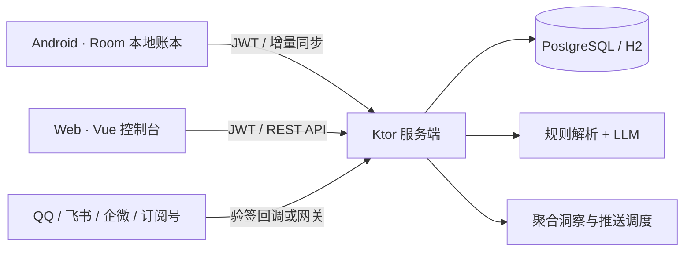

<div align="center">


<h1>RinklNote · 记一笔</h1>

<p>随手记账，跨端同步，用 AI 看懂自己的消费。</p>

<p><strong>Android App · Ktor Server · Vue Web Console</strong></p>

<p>
  <a href="#亮点">功能亮点</a> ·
  <a href="#快速开始">快速开始</a> ·
  <a href="#架构与数据流">系统架构</a> ·
  <a href="#部署">部署指南</a> ·
  <a href="#文档索引">详细文档</a>
</p>

</div>

---

RinklNote 是一套**离线优先的个人记账系统**。Android 负责日常随手记账，Web 提供浏览器控制台，服务端连接多端数据与 AI 能力；也可以通过 QQ、飞书、企业微信和订阅号机器人记账。

仓库采用 Gradle 多模块 + npm 独立构建的 Monorepo 结构，UI 文案与代码注释统一使用中文。

## 亮点

| 方向 | 能力 |
|---|---|
| 记账 | 手动、语音、自然语言、模板、CSV 导入、小票 OCR、位置打点与分享图 |
| 规划 | 月度预算、分类预算、账户、挑战计划、成就与主题 |
| 洞察 | 月度总结、异常提醒、习惯建议、自然问账、账单教练 |
| 同步 | 离线优先、增量同步、软删除、Last-Writer-Wins、乐观锁 |
| 多端 | Android、Web 控制台、QQ、飞书、企业微信、订阅号 |
| 安全 | JWT、管理员守卫、机器人验签、限流、敏感配置掩码 |

金额在三端统一使用整数分作为权威格式，业务时区统一为 `Asia/Shanghai`。

### 各端分工

| 入口 | 适合做什么 | 说明 |
|---|---|---|
| Android | 日常记账、预算、地图、挑战与桌面小组件 | 本地 Room 支持离线记账 |
| Web | 浏览、搜索、图表、账户与设置 | PWA 缓存应用壳，业务 API 需要联网 |
| QQ / 飞书 / 企业微信 | 自然语言记账、问账与推送 | 绑定账户后使用，主动推送按飞书 → 企业微信 → QQ 选择通道 |
| 订阅号 | 消息记账与被动回复 | 不参与主动推送调度 |

## 项目结构

```text
RinklNote/
├─ app/       Android 客户端（Kotlin + Compose + Room）
├─ server/    Ktor 服务端（Netty + Exposed + JWT）
├─ web/       Vue 3 + Vite + Pinia Web 控制台
├─ resource/  图标等静态资源
├─ docs/      使用、技术、审查和阶段文档
├─ FEATURES.md
├─ AGENTS.md
└─ gradle/libs.versions.toml
```

源码入口：

- Android：`app/src/main/java/com/example/rinklnote/`
- Server：`server/src/main/kotlin/com/example/rinklnote/server/Application.kt`
- Web：`web/src/`
- Room schema：`app/schemas/`

## 技术栈

| 模块 | 技术 |
|---|---|
| Android | Kotlin 2.0.21、Jetpack Compose、Material 3、Room 2.6.1、KSP、Retrofit、DataStore、Coil、osmdroid |
| Server | Kotlin/JVM 17、Ktor 2.3.13、Netty、Exposed 0.51.1、HikariCP、PostgreSQL/H2、JWT、jBCrypt、BouncyCastle |
| Web | Vue 3.5、Vite 6、TypeScript 5.6、Pinia、Vue Router、ECharts、Vitest |
| 构建 | Gradle 8.13、Android Gradle Plugin 8.13、npm |

依赖版本统一维护在 `gradle/libs.versions.toml`，不要在模块构建文件中硬编码版本。

## 快速开始

### 1. 准备 Gradle 环境

需要 Android SDK 36、兼容的 JDK，以及 Node.js / npm。Android 最低支持 Android 9（API 28）；Gradle Wrapper 已包含在仓库中。

Windows 本机使用 Android Studio 自带 JBR（当前为 JDK 21），并设置独立缓存目录，避免系统 JDK 24 与用户路径中的撇号影响测试。以下路径按自己的安装位置调整：

```powershell
$env:JAVA_HOME = 'D:/Codes/AndroidStudio/jbr'
$env:GRADLE_USER_HOME = 'D:/Codes/RinklNote/.gradle-home'
$env:ANDROID_USER_HOME = 'D:/Codes/RinklNote/.android-home'
```

在 Android Studio 中配置 SDK，或在不提交到 Git 的 `local.properties` 中设置 `sdk.dir`。App 编译目标为 JVM 11，Server 编译目标为 JVM 17。

### 2. 构建 Android 与 Server

```powershell
./gradlew :app:assembleDebug
./gradlew :app:assembleRelease
./gradlew :app:testDebugUnitTest
./gradlew :server:test
./gradlew :server:installDist
```

### 3. 安装并构建 Web

```powershell
cd web
npm ci
npm run typecheck
npm run test
npm run build
npm run dev
```

开发服务器默认运行在 `http://localhost:5173`，Vite 已将 `/api` 代理到本地 Ktor 服务的 `8080` 端口。构建产物位于 `web/dist/`，可用 `npm run preview` 预览静态页面。

Android 本地联调需要调整 `RetrofitClient.BASE_URL`：模拟器使用 `http://10.0.2.2:8080/`，真机使用开发机的局域网地址。当前默认值指向部署服务器。

<details>
<summary><strong>更多验证命令</strong></summary>

```powershell
./gradlew :app:installDebug             # 安装到已连接设备
./gradlew :app:connectedAndroidTest     # 仪器测试，需要设备或模拟器
./gradlew :app:lint
./gradlew :server:test --tests 'com.example.rinklnote.server.MoneyTest'
```

</details>

## 本地运行 Server

Server 启动会拒绝空值或仓库中的默认 JWT 密钥。配置真实的 DeepSeek API Key 后才能使用 LLM 解析与洞察。使用 H2 的本地示例：

```powershell
$jwtBytes = New-Object byte[] 32
$jwtGenerator = [System.Security.Cryptography.RandomNumberGenerator]::Create()
$jwtGenerator.GetBytes($jwtBytes)
$jwtGenerator.Dispose()
$env:JWT_SECRET = [Convert]::ToBase64String($jwtBytes)
$env:DEEPSEEK_API_KEY = '你的 DeepSeek API Key'
$env:DATABASE_URL = 'jdbc:h2:file:D:/Codes/RinklNote/.gradle-home/local-data/h2;DB_CLOSE_DELAY=-1'
./gradlew :server:run
```

默认监听 `8080`，可通过 `PORT` 修改。生产环境请使用 PostgreSQL 或持久化 H2，并把密钥放入受控的 systemd EnvironmentFile，不要提交到 Git。

<details>
<summary><strong>服务端环境变量一览</strong></summary>

| 变量 | 必需 | 说明 |
|---|:---:|---|
| `PORT` |  | HTTP 端口，默认 `8080` |
| `JWT_SECRET` | ✓ | JWT 签名密钥，拒绝空值和预置占位值 |
| `JWT_ISSUER` / `JWT_AUDIENCE` |  | JWT issuer/audience，默认 `rinklnote-server` / `rinklnote-app` |
| `DATABASE_URL` |  | JDBC 地址；配置文件默认 PostgreSQL |
| `DATABASE_USER` / `DATABASE_PASSWORD` |  | PostgreSQL 凭据；当前 H2 分支不读取这两项 |
| `DEEPSEEK_API_KEY` | ✓ | NLU fallback 与 AI 洞察 |
| `DEEPSEEK_BASE_URL` / `DEEPSEEK_MODEL` |  | LLM 地址和模型 |
| `LLM_TIMEOUT_MS` |  | LLM 超时，默认 `10000` |
| `ASR_API_KEY` / `ASR_BASE_URL` / `ASR_MODEL` / `ASR_TIMEOUT_MS` |  | Whisper 语音转写，可选 |
| `ADMIN_IDENTITIES` |  | 管理员手机号或 userId，逗号分隔 |
| `LEARNING_INTERVAL_MIN` |  | 关键词学习周期，默认 `60` 分钟 |
| `ANOMALY_THRESHOLD` |  | 异常支出增幅阈值，默认 `1.5` |
| `MAIL_INGEST_USER_ID`、`MAIL_IMAP_*` |  | 全部配置后启用邮件账单入账 |

邮件入账至少需要 `MAIL_INGEST_USER_ID`、`MAIL_IMAP_HOST`、`MAIL_IMAP_USER`、`MAIL_IMAP_PASSWORD`；可选 `MAIL_IMAP_PORT`（默认 993）、`MAIL_INGEST_INTERVAL_MS` 和 `MAIL_SENDER_WHITELIST`。

</details>

QQ、飞书、企业微信和订阅号凭据通过 Web 设置页保存到 `bot_config` 表，并以掩码形式回显。

## 架构与数据流



### Android

```text
AppDatabase → Repository → ViewModel(StateFlow) → Compose UI
```

Android 使用单 Activity、MVVM + Repository 和手动依赖注入。导航由 Jetpack Navigation Compose 的 `NavHost` 编排，启动页是记账页，底部 Tab 为计划、记账、资产和我的。

`MoreDrawer` 统一进入地图、导入、多币种、搜索和 Rk 省钱计划。Room 当前版本为 18，`MIGRATION_1_2` 到 `MIGRATION_17_18` 均已登记，不使用破坏性迁移兜底。

## Web 路由

- `/`：产品落地页
- `/login`：登录与注册
- `/console/*`：账单、资产、图表、记账和设置控制台
- `/admin`：管理员只读面板，无权限时返回 404

App 内 WebView 深链必须使用 `/console/*` 前缀。

## API 分区

账户与账单等业务 API 使用 JWT。注册、登录和分类列表公开；机器人回调使用通道验签，`/api/ai` 的个人助手接口使用个人 Token，头像静态资源通过 `/uploads/*` 暴露。

| 路径 | 内容 |
|---|---|
| `/api/auth/*` | 注册、登录、用户资料、头像、改密、AI 与日报设置 |
| `/api/bills/*` | 账单 CRUD、分类、账户、搜索、增量同步、NLU、语音转写 |
| `/api/accounts`、`/api/budgets`、`/api/templates` | 账户、预算、模板 |
| `/api/challenges`、`/api/rates` | 挑战计划、汇率 |
| `/api/insights/*`、`/api/ai/*` | AI 洞察、自然问账、个人 Token |
| `/api/corrections`、`/api/keywords` | 修正反馈、自定义关键词 |
| `/api/qq-bot/*`、`/api/feishu-bot/*`、`/api/wecom-bot/*` | 机器人管理与绑定 |
| `/api/qq/bot/webhook`、`/api/feishu/bot/webhook`、`/api/wecom/bot/webhook`、`/api/mp/bot/webhook` | 官方机器人回调 |
| `/api/admin/*` | 管理员只读运维数据 |

旧 QQ 共享密钥协议和 QQ 登录码端点已经下线，新接入请使用当前 Bot webhook 和绑定流程。

## 数据约定

- 金额：Android `amountMinor: Long`、Server `amount_minor BIGINT`、Web `amountMinor`。
- 兼容：API 保留旧版 `amount` 元字段，始终序列化输出供旧客户端读取。
- 时间：`Bill.date` 保存业务时区当天零点，用于按日分组。
- 同步：本地优先 + Last-Writer-Wins；编辑、删除使用软删除墓碑；增量拉取依赖 `updated_at`；条件 PUT 使用 `base_updated_at` 乐观锁。
- 隐私约定：账单洞察只允许发送分类、金额、日期的聚合结果；自然问账已按日期和分类聚合最近支出。关键词自学习仍存在原始修正文本外发风险，详见下方已知事项。

## 部署

服务端使用 `installDist` 生成完整发行目录：

```bash
./gradlew :server:installDist --no-daemon --console=plain
tar -czf rinklnote-server.tar.gz -C server/build/install server
scp rinklnote-server.tar.gz <deploy-host>:/tmp/
```

上传前后核对 SHA-256，然后按部署环境完成以下步骤：

1. 停止 `rinklnote.service`，备份数据库和当前发行目录。
2. 解压新发行包，保留原有 `uploads/` 与数据目录；恢复 `bin/server` 的执行权限和服务用户所有权。
3. 使用受控环境变量启动服务，检查日志、端口、接口和公网反向代理。

部署后检查（以下路径对应现有 systemd 部署）：

```bash
sudo systemctl is-active rinklnote
sudo journalctl -u rinklnote -n 50 --no-pager
curl -i http://127.0.0.1:8080/api/bills/categories
curl -i http://127.0.0.1:8080/api/auth/me
```

Web 部署上传完整 `web/dist/`，Nginx 将 `/api` 和 `/uploads` 代理到 Ktor，并将 SPA 深链回退到 `index.html`。详细步骤见 [`docs/deploy-checklist-2026-09-18.md`](docs/deploy-checklist-2026-09-18.md)。

<details>
<summary><strong>遇到 502 Bad Gateway 时</strong></summary>

先确认 Ktor 是否启动并监听 8080，再检查 Nginx 上游配置：

```bash
sudo systemctl status rinklnote --no-pager
sudo journalctl -u rinklnote -n 100 --no-pager
ss -ltnp | grep ':8080'
curl -i http://127.0.0.1:8080/api/bills/categories
sudo nginx -t
```

分类接口正常应返回 200；未登录访问 `/api/auth/me` 应返回 401。`systemctl is-active` 只说明进程状态，验收仍需实际请求接口。

</details>

## 文档索引

- [功能现状与升级规划](FEATURES.md)
- [使用文档](docs/使用文档.md)
- [技术文档](docs/技术文档.md)
- [金额精度迁移方案](docs/金额精度迁移方案.md)
- [前后端审查报告](docs/前后端审查报告-2026-09-29.md)
- [部署清单](docs/deploy-checklist-2026-09-18.md)
- `docs/superpowers/specs/` 与 `docs/superpowers/plans/`：历史设计与实施计划

## 已知债务 / 待办

- 2026-09-29 的 Server 回归测试中，注册限流让共享 `127.0.0.1` 的多个用例收到 429，测试隔离待完善；Web 同次构建出现 Charts chunk 超过 500 kB 的提示。具体证据见审查报告，后续状态以实际验证为准。
- `LearningService.processCorrections` 仍会把 `originalText` 放入 LLM 提示词，尚未满足上述隐私约定。
- 旧版金额兼容字段和语音/OCR 等外部边界仍使用 `Double`，核心账单存储和同步不受影响。
- 邮件入账依赖 IMAP SEEN 标记判重，尚无 Message-ID 台账。
- 生产环境的 PostgreSQL 迁移、机器人真实回调、邮件入账和恢复演练需要按部署清单单独验收。
